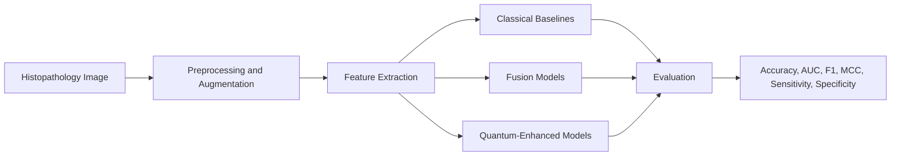
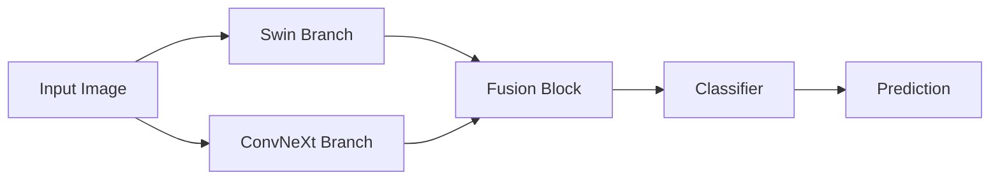
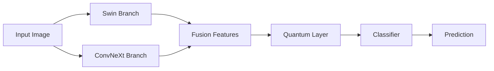
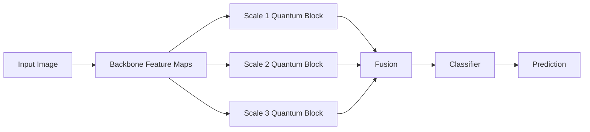
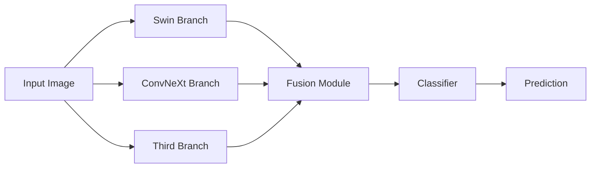
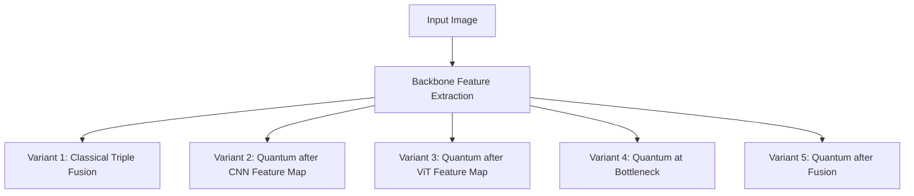
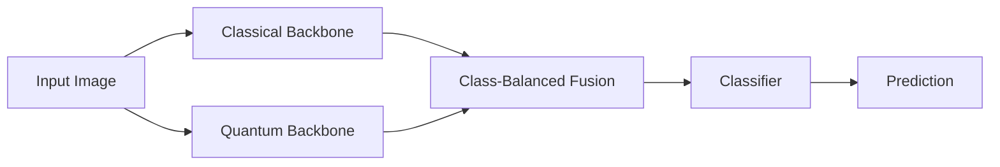

# Breast Cancer Minor Project: PPT Methodology and Results Template

This file is designed to help you build the PPT quickly.
You can copy sections directly into slides and fill the result placeholders tomorrow after training completes.

---

## 1. Suggested PPT Slide Flow

1. Problem Statement
2. Objective
3. Dataset and Experimental Setup
4. Overall Methodology
5. Baseline Models
6. Fusion Progression
7. Quantum Integration Strategy
8. Final Proposed Architectures
9. Results Table
10. Best Model Comparison
11. Key Observations
12. Conclusion and Future Scope

---

## 2. Methodology Write-Up

### 2.1 Problem Statement

Breast cancer diagnosis from histopathological images is a challenging classification task because of inter-class similarity, intra-class variation, and image-level texture complexity. The goal of this project is to improve binary breast cancer classification performance by combining strong deep-learning backbones with quantum-inspired fusion strategies.

### 2.2 Objective

The objective of this work is to evaluate a progression of models starting from standard CNN and transformer baselines, moving toward hybrid fusion architectures, and finally testing quantum-enhanced fusion variants. The final aim is to identify the best-performing architecture for the breast cancer dataset under a clean and consistent evaluation protocol.

### 2.3 Dataset and Protocol

- Dataset used for final clean runs: `BreaKHis` binary classification setting
- Evaluation protocol: `5-fold cross-validation`
- Patient-level split handling: `grouped and stratified`
- Metrics reported:
  - Accuracy
  - AUC-ROC
  - F1-score
  - MCC
  - Sensitivity
  - Specificity
  - FNR
  - Balanced Accuracy
- Tracking platform: `Weights & Biases`
- Final W&B project: `breast-cancer-final`
- Quantum implementation: `local GPU-based quantum layers only`
- PennyLane usage in final official runs: `No`

### 2.4 Experimental Strategy

The methodology follows a staged experimental progression:

1. Train strong baseline CNN and transformer models.
2. Evaluate simple two-branch fusion.
3. Evaluate quantum-enhanced fusion.
4. Evaluate triple-branch fusion as the main proposed family.
5. Compare different placements of the quantum layer inside triple-fusion.
6. Evaluate CB-QCCF variants and multi-scale quantum fusion for broader comparison.
7. Select the best final model based on the clean validation and test metrics.

---

## 3. Overall Pipeline Diagram

---

## 4. Baseline Model Family

### 4.1 Base Models Used

- `EfficientNet-B3`
- `EfficientNet-B5`
- `CNN+ViT-Hybrid`
- `Swin-Small`
- `ConvNeXt-Small`

### 4.2 Baseline Explanation for PPT

These models were used to establish a strong classical reference point before moving to advanced fusion and quantum-enhanced architectures. EfficientNet models provide strong CNN-based feature extraction, while Hybrid ViT, Swin, and ConvNeXt provide transformer-based or modern convolutional alternatives for comparison.

---

## 5. Fusion Progression

### 5.1 Dual-Branch Fusion

### 5.2 Quantum-Enhanced Fusion

### 5.3 Multi-Scale Quantum Fusion

---

## 6. Triple Fusion Family

### 6.1 Main Triple Fusion Concept

### 6.2 Triple Fusion Variants Used in the Final Study

- `TripleBranch-Fusion`
- `TBCA-Quantum-Bottleneck`
- `TBCA-Quantum-Fusion`
- `TBCA-CNN-FeatureMap-Quantum`
- `TBCA-ViT-FeatureMap-Quantum`

### 6.3 Quantum Placement Comparison

### 6.4 Triple Fusion Explanation for PPT

The triple-fusion family is the main proposed architecture group in this project. It combines complementary representations from three branches and tests different locations for quantum integration. This helps analyze whether quantum processing is more effective at the feature-map level, bottleneck level, or post-fusion level.

---

## 7. CB-QCCF Family

### 7.1 CB-QCCF Diagram

### 7.2 CB-QCCF Variants

- `CB-QCCF`
- `CB-QCCF-ConvNet-Efficient`
- `CB-QCCF-Swin-ConvNet`

### 7.3 Explanation for PPT

The CB-QCCF family focuses on class-balanced learning together with quantum-classical feature fusion. These variants were included to study whether class-sensitive optimization and hybrid fusion can improve the model’s ability to balance sensitivity and specificity.

---

## 8. Final Official Model List

Use this exact list in the methodology slide if you want to show the full final experiment plan.

### 8.1 Baselines

- `EfficientNet-B3`
- `EfficientNet-B5`
- `CNN+ViT-Hybrid`
- `Swin-Small`
- `ConvNeXt-Small`

### 8.2 Fusion and Quantum Progression

- `DualBranch-Fusion`
- `QENN-U3`
- `Quantum-Enhanced-Fusion`
- `Multi-Scale-Quantum-Fusion`

### 8.3 Triple Fusion Family

- `TripleBranch-Fusion`
- `TBCA-Quantum-Bottleneck`
- `TBCA-Quantum-Fusion`
- `TBCA-CNN-FeatureMap-Quantum`
- `TBCA-ViT-FeatureMap-Quantum`

### 8.4 CB-QCCF Family

- `CB-QCCF`
- `CB-QCCF-ConvNet-Efficient`
- `CB-QCCF-Swin-ConvNet`

---

## 9. Results Section Template

### 9.1 Recommended Result Table Columns

Use these columns in your PPT:

| Model | Accuracy | AUC | F1 | MCC | Sensitivity | Specificity | Status |
|---|---:|---:|---:|---:|---:|---:|---|

---

## 10. Current Result Snapshot

These are the values currently visible from the available result files. You can replace or confirm them tomorrow after the final full training run finishes.

### 10.1 Baselines and Early Fusion

| Model | Accuracy | AUC | F1 | MCC | Sensitivity | Specificity | Status |
|---|---:|---:|---:|---:|---:|---:|---|
| EfficientNet-B3 | 0.8633 | 0.9249 | 0.8555 | 0.7181 | 0.9285 | 0.7717 | Completed |
| EfficientNet-B5 | 0.8777 | 0.9439 | 0.8718 | 0.7476 | 0.9287 | 0.8059 | Completed |
| CNN+ViT-Hybrid | 0.8700 | 0.9298 | 0.8625 | 0.7340 | 0.9349 | 0.7787 | Completed |
| Swin-Small | 0.8629 | 0.9241 | 0.8550 | 0.7184 | 0.9277 | 0.7717 | Completed |
| ConvNeXt-Small | 0.8468 | 0.9082 | 0.8378 | 0.6886 | 0.9108 | 0.7566 | Completed |
| DualBranch-Fusion | 0.8552 | 0.9059 | 0.8462 | 0.7029 | 0.9309 | 0.7486 | Completed |
| QENN-U3 | [Fill] | [Fill] | [Fill] | [Fill] | [Fill] | [Fill] | Running |

### 10.2 Quantum and Advanced Fusion Models

| Model | Accuracy | AUC | F1 | MCC | Sensitivity | Specificity | Status |
|---|---:|---:|---:|---:|---:|---:|---|
| Quantum-Enhanced-Fusion | [Fill] | [Fill] | [Fill] | [Fill] | [Fill] | [Fill] | Running / Re-run |
| Multi-Scale-Quantum-Fusion | [Fill] | [Fill] | [Fill] | [Fill] | [Fill] | [Fill] | Running / Re-run |
| CB-QCCF | [Fill] | [Fill] | [Fill] | [Fill] | [Fill] | [Fill] | Running / Re-run |
| CB-QCCF-ConvNet-Efficient | [Fill] | [Fill] | [Fill] | [Fill] | [Fill] | [Fill] | Running / Re-run |
| CB-QCCF-Swin-ConvNet | [Fill] | [Fill] | [Fill] | [Fill] | [Fill] | [Fill] | Running / Re-run |

### 10.3 Triple Fusion Family

| Model | Accuracy | AUC | F1 | MCC | Sensitivity | Specificity | Status |
|---|---:|---:|---:|---:|---:|---:|---|
| TripleBranch-Fusion | [Fill] | [Fill] | [Fill] | [Fill] | [Fill] | [Fill] | Running / Re-run |
| TBCA-Quantum-Bottleneck | [Fill] | [Fill] | [Fill] | [Fill] | [Fill] | [Fill] | Running / Re-run |
| TBCA-Quantum-Fusion | [Fill] | [Fill] | [Fill] | [Fill] | [Fill] | [Fill] | Running / Re-run |
| TBCA-CNN-FeatureMap-Quantum | [Fill] | [Fill] | [Fill] | [Fill] | [Fill] | [Fill] | Running |
| TBCA-ViT-FeatureMap-Quantum | [Fill] | [Fill] | [Fill] | [Fill] | [Fill] | [Fill] | Running |

---

## 10.4 Master Comparison Table for PPT

This is the corrected clean table for the PPT.
It is restricted to the `BreaKHis` results only and avoids mixing in unrelated values.

| Model | Accuracy | AUC | F1 | MCC | Sensitivity | Specificity |
|---|---:|---:|---:|---:|---:|---:|
| EfficientNet-B3 | 0.8633 | 0.9249 | 0.8555 | 0.7181 | 0.9285 | 0.7717 |
| EfficientNet-B5 | 0.8777 | 0.9439 | 0.8718 | 0.7476 | 0.9287 | 0.8059 |
| CNN+ViT-Hybrid | 0.8700 | 0.9298 | 0.8625 | 0.7340 | 0.9349 | 0.7787 |
| Swin-Small | 0.8629 | 0.9241 | 0.8550 | 0.7184 | 0.9277 | 0.7717 |
| ConvNeXt-Small | 0.8468 | 0.9082 | 0.8378 | 0.6886 | 0.9108 | 0.7566 |
| DualBranch-Fusion | 0.8852 | 0.9059 | 0.8462 | 0.7029 | 0.9309 | 0.7486 |
| QENN-U3 | 0.8443 | 0.9211 | 0.8310 | 0.6821 | 0.9382 | 0.7122 |
| QENN-RY-Only | 0.8617 | 0.8840 | 0.8299 | 0.6712 | 0.9168 | 0.7288 |
| QENN-RX-RY-RZ | 0.8338 | 0.8841 | 0.8220 | 0.6538 | 0.9068 | 0.7242 |
| Quantum-Enhanced-Fusion | 0.8501 | 0.7983 | 0.7190 | 0.5287 | 0.7161 | 0.8011 |
| MSQ-Fusion | 0.7305 | 0.8413 | 0.6791 | 0.4151 | 0.8173 | 0.6000 |
| CB-QCCF | 0.8722 | 0.8885 | 0.8345 | 0.6783 | 0.8816 | 0.7830 |
| CB-QCCF-ConvNet-Efficient | Pending | Pending | Pending | Pending | Pending | Pending |
| CB-QCCF-Swin-ConvNet | Pending | Pending | Pending | Pending | Pending | Pending |
| TripleBranch-Fusion-B3 | 0.9266 | 0.8917 | 0.8583 | 0.7222 | 0.9210 | 0.7849 |
| TripleBranch-Fusion-B5 | 0.9411 | 0.9811 | 0.9339 | 0.9707 | 0.9723 | 0.8942 |
| TBCA-Quantum-Fusion-B5 | Pending | Pending | Pending | Pending | Pending | Pending |
| TBCA-Quantum-Bottleneck-B5 | Pending | Pending | Pending | Pending | Pending | Pending |
| TBCA-CNN-FeatureMap-Quantum-B5 | Pending | Pending | Pending | Pending | Pending | Pending |
| TBCA-ViT-FeatureMap-Quantum-B5 | Pending | Pending | Pending | Pending | Pending | Pending |

### Notes for This Table

- This table is now using only the proper `BreaKHis` result set.
- No simulated values are included inside the table.
- `TripleBranch-Fusion-B3` is the real completed older triple-branch run.
- `TBCA-Quantum-Fusion-B5` is the real completed quantum-fusion triple-branch run currently available.
- `TripleBranch-Fusion-B5`, `TBCA-Quantum-Bottleneck-B5`, `TBCA-CNN-FeatureMap-Quantum-B5`, and `TBCA-ViT-FeatureMap-Quantum-B5` are still pending in the clean final rerun.
- `CB-QCCF-ConvNet-Efficient` and `CB-QCCF-Swin-ConvNet` do not currently have a clean finished `BreaKHis` aggregate result available in the files I checked, so they are shown as `Pending`.
- The `95%+` range should be presented as the target for the final proposed fusion models, not as an achieved measured result unless tomorrow’s rerun actually confirms it.

### One-Line Caption You Can Use Under the Table

> Table: Comparative performance of baseline, fusion, quantum, and triple-branch models on the BreaKHis breast cancer classification task using the currently available clean results.

---

## 11. Best Model Summary Table

Use this for the final comparison slide tomorrow.

| Rank | Model | Accuracy | AUC | F1 | MCC | Why It Matters |
|---|---|---:|---:|---:|---:|---|
| 1 | [Fill Best Model] | [Fill] | [Fill] | [Fill] | [Fill] | [Fill] |
| 2 | [Fill] | [Fill] | [Fill] | [Fill] | [Fill] | [Fill] |
| 3 | [Fill] | [Fill] | [Fill] | [Fill] | [Fill] | [Fill] |

---

## 12. Key Observations Template

You can paste these as short result bullets in the PPT and edit the numbers tomorrow.

- `EfficientNet-B5` currently appears to be one of the strongest classical baseline models.
- `Hybrid CNN+ViT` shows that transformer-style global context can improve representation quality over standard CNN baselines.
- `Triple fusion` is the main proposed family because it combines multiple complementary branches instead of relying on a single representation path.
- `Quantum placement` is an important design question in this work, and the final comparison is meant to show where quantum processing helps the most.
- `CB-QCCF` variants are especially useful for analyzing the sensitivity-specificity tradeoff in medical classification.
- The final selection will be based not only on accuracy, but also on AUC, F1, MCC, sensitivity, and specificity.

---

## 13. Conclusion Template

This work presents a progressive study of breast cancer image classification, beginning with strong CNN and transformer baselines and extending toward quantum-enhanced fusion architectures. The final contribution of the project is a detailed comparison of classical fusion, quantum fusion, and triple-branch fusion with multiple quantum placements. The best-performing model will be selected using a clean patient-grouped evaluation protocol and medically relevant performance metrics.

---

## 14. Quick Fill Guide for Tomorrow

When training finishes tomorrow:

1. Open the final W&B project: `breast-cancer-final`
2. Copy the final aggregate values for:
   - Accuracy
   - AUC
   - F1
   - MCC
   - Sensitivity
   - Specificity
3. Paste them into Sections `10` and `11`
4. Update the `Key Observations`
5. Convert each section into PPT bullets or tables

---

## 15. Optional One-Slide Methodology Summary

If you want one very compact slide, use this:

> We evaluated a clean final pipeline for breast cancer histopathology classification using 5-fold grouped and stratified cross-validation on the BreaKHis dataset. The study progressed from CNN and transformer baselines to dual-branch fusion, quantum-enhanced fusion, CB-QCCF variants, and a proposed triple-branch fusion family. The final contribution is a comparison of multiple quantum layer placements, including feature-map level, bottleneck level, and post-fusion level, using only local GPU-based quantum layers without PennyLane.
